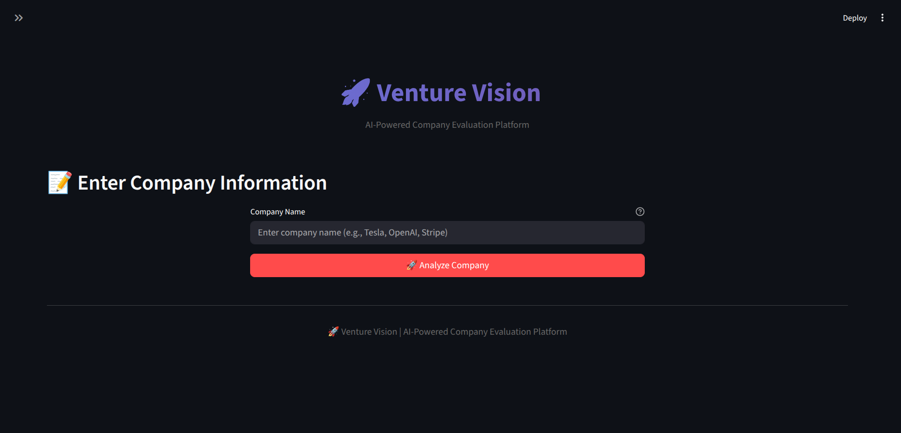
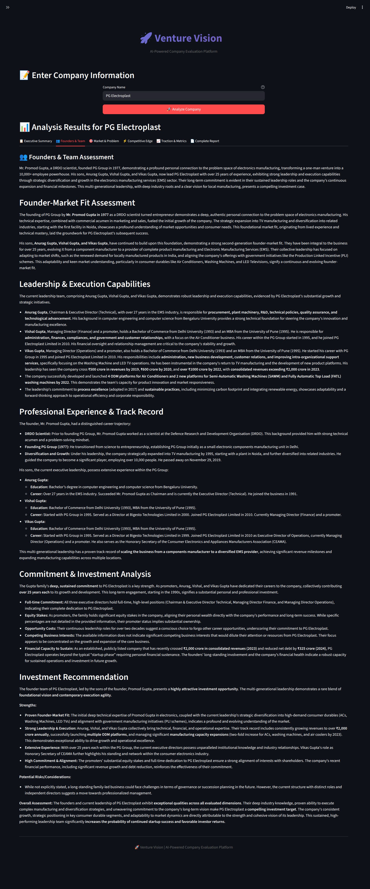
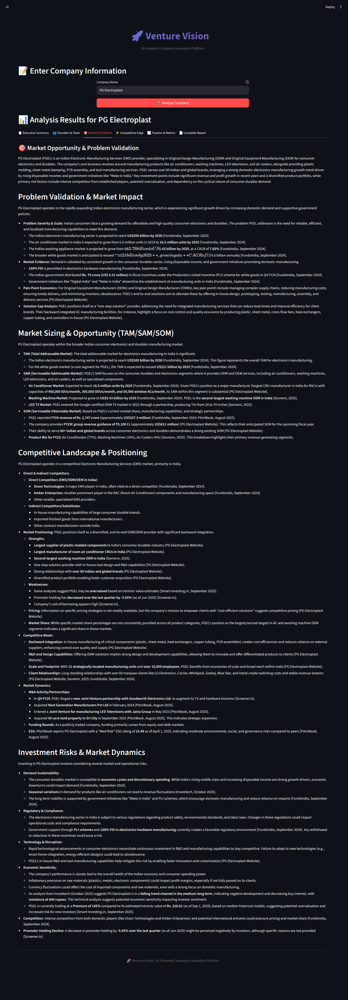
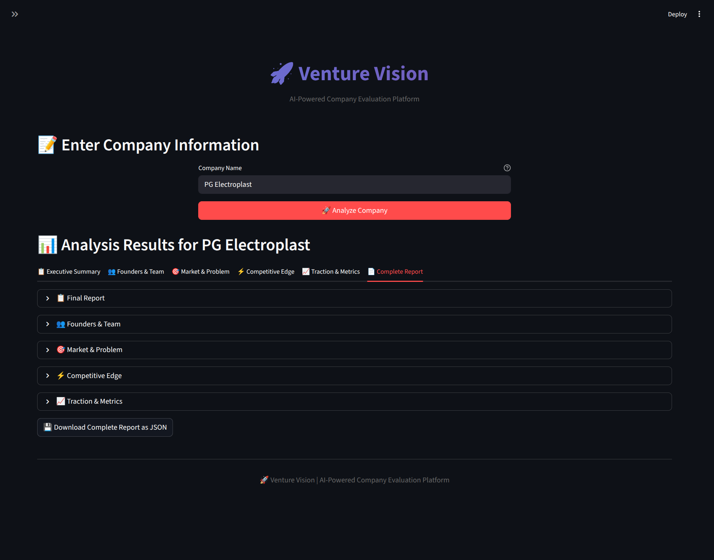

# Venture Vision Fastapi Backend

#### Venture Vision backend application created using FastApi and Postgres. 

## Table of contents

- [Demo](#demo)
  - [Getting Started](#getting-started)
  - [Application Screenshots](#application-screenshots)
- [Prerequisites](#prerequisites)
- [Key Features](#key-features)
- [Setup Instructions](#setup-instructions)
  - [Clone the repository](#clone-the-repository)
  - [Environment Configuration](#environment-configuration)
  - [Setup Options](#setup-instructions)
- [Development Commands](#development-commands)
  - [Docker Container Management](#docker-container-management)
  - [Database Management](#database-management)
  - [Testing](#testing)
  - [Code Quality](#code-quality)
  - [Cleanup Commands](#cleanup-commands)
  - [Help](#help)
- [Troubleshooting](#troubleshooting)


## Demo

Here's a walkthrough of the Venture Vision application:

### Getting Started

#### Enter startup/compnay details 


### Application Screenshots

#### Overall investment report and executive summary


#### Founder and Team analysis


#### Market opportunity and problem validation


#### Unique diffrentiator analysis


#### Buisness matrics and traction analysis


#### Complete report download


## Prerequisites

Before setting up the project, ensure you have the following installed:

- [Python 3.9+](https://www.python.org/)
- [Docker and Docker Compose (For docker setup)](https://www.docker.com/)
- [UV (For Local setup)](https://docs.astral.sh/uv/)
- [PostgreSQL (For Local setup)](https://www.postgresql.org/)

## Setup Instructions

### Clone the repository

```bash
$ git clone <repository-url>
```

### Environment Configuration

Create two environment files:

1. `.env` - Application configuration
2. `.env.docker` - Docker and database configuration

```bash
cp .env.example .env
cp .env.docker.example /local/.env.docker
```

### Setup Options

#### 1. Docker Setup (Recommended)

```bash
# Start all services in background
make up-d

# Build images without cache (if needed)
make build-no-cache
```

#### 2. Local Development Setup

```bash
# Step 1: Create virtual environment and get setup instructions
make setup

# Step 2: Activate the virtual environment
source .venv/bin/activate  # For Unix/Linux/MacOS
# OR
.venv\Scripts\activate     # For Windows

# Step 3: Install project dependencies
make install-deps

# Step 4: Run the application
make run
```

Note: Make sure to activate the virtual environment before running any local development commands. The system will
remind you if you forget to do so.

## Development Commands

### Docker Container Management

```bash
# Start/Stop Services
make up              # Start in foreground
make up-d            # Start in background
make down            # Stop and remove containers
make restart         # Restart all containers
make stop            # Stop containers
make start           # Start stopped containers

# Container Status
make status          # View container status
make ps              # List running containers

# Access Containers
make shell           # Access application container shell
make db-shell        # Access PostgreSQL database shell

# View Logs
make logs            # View all container logs
make logs-app        # View application logs
make logs-db         # View database logs
```

### Database Management

```bash
# Migrations
make db-migrate                          # Apply all pending migrations
make db-downgrade                        # Rollback the last migration
make db-revision message="description"   # Create a new migration
```

### Testing

```bash
make test               # Run all tests
make test-unit         # Run unit tests only
make test-integration  # Run integration tests only
make test-e2e          # Run end-to-end tests only
make test-cov          # Run tests with coverage report
make test-watch        # Run tests in watch mode
```

### Code Quality

```bash
make install-pre-commit   # Install pre-commit hooks
make update-pre-commit    # Update pre-commit hooks
make lint                 # Run all pre-commit checks
```

### Cleanup Commands

```bash
make clean           # Remove unused Docker resources
make clean-volumes   # Remove Docker volumes
make clean-all       # Remove all Docker resources (including volumes)
```

### Help

For a complete list of available commands:

```bash
make help
```

## Troubleshooting

If you encounter any issues:

1. Check container status using `make status`
2. View application logs using `make logs-app`
3. Ensure all environment variables are properly set in `.env` and `.env.docker`
4. If you're running in local environment and having issues with environment variables:
   - Try unsetting all environment variables using `make unset-env`
5. For database issues:
   - Access the database shell using `make db-shell`
   - Check postgres environment variables in `.env` (database host should be `localhost` for local setup and `postgres`
     (container name) for Docker setup)
   - Verify database migrations using `make db-migrate`
6. If you are on Windows and encounter issues running scripts due to CRLF (Carriage Return + Line Feed) line endings:
   - Convert the script files to use LF (Line Feed) endings. You can do this using editors like VS Code ("Change End of
     Line Sequence" to LF)

For additional commands and options, run `make help`.
